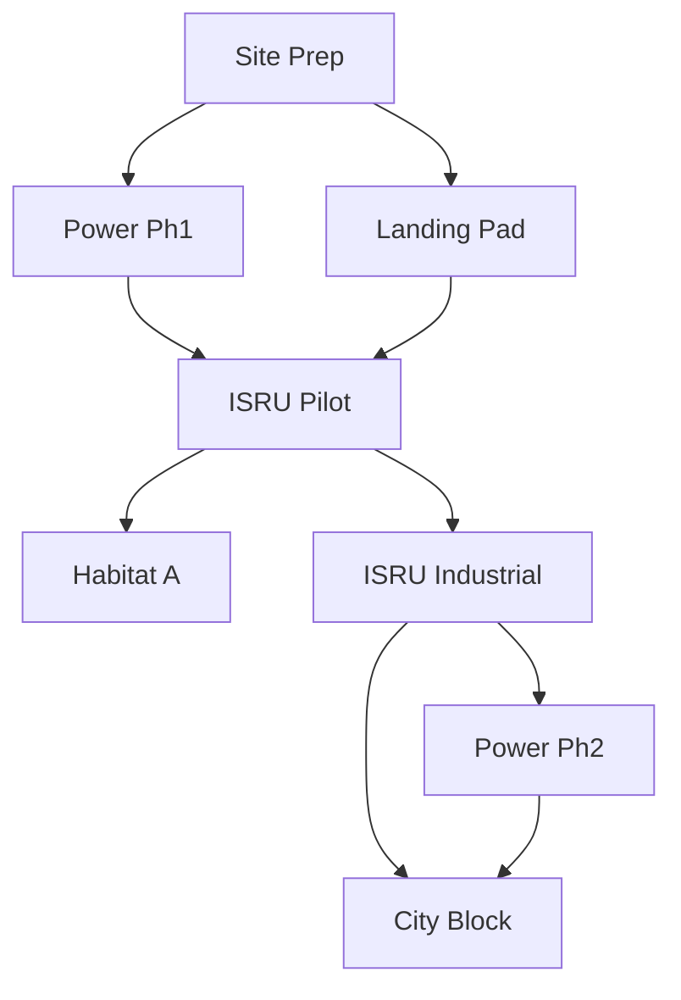

# 模型实施细节参数 (Implementation Details & Parameters)

> **Warning**: 这些参数基于当前（2025-2026）的航天工程研究与技术预测，作为模型输入的“基准假设” (Baseline Assumptions)。在实际仿真中，建议对关键变量（如 ISRU 产率、发射成本）进行灵敏度分析。

### 1. 物料清单 (BOM) & 需求映射
*   **物资分类 (Tier System)**:
    *   **Tier 1 (精密种子 Class 1)**: 芯片、传感器 ($\chi \approx 1$). 初始 15% $\to$ <1%. **100% 地球运输**.
    *   **Tier 2 (工业中枢 Class 2)**: 电机、工具 ($\chi \in [0.3, 0.7]$). 初始 35% $\to$ ~4%. **混合来源**.
    *   **Tier 3 (基础资源 Class 3)**: 结构、氧气、水 ($\chi \to 0$). 初始 50% $\to$ >95%. **100% ISRU**.
*   **总量约束**: 总需求 $10^8$ 吨 (Cumulative).

### 2. 物流网络定义 (Logistics)
*   **火箭运力 ($U_a$)**: 逻辑回归增长. 2050年单次 $L_{cap} \approx 100 \sim 150$ MT. 极限 $L_{max} \approx 250$ MT.
*   **发射成本 ($c_{a,r,t}$)**: Wright's Law + Transcost. 2050年 $\approx 100 \sim 200$ USD/kg.
*   **太空电梯容量**: 上限 $F_{elevator} = 179,000$ 吨/年.
*   **环境约束**: 加权排放指数 (WEI)，黑碳 (BC) 权重 500.

### 3. 月面生产能力 (ISRU & Bootstrapping)
*   **自举动力学**: $\dot{P} = \eta \phi P + \beta T_1$.
*   **关键参数**:
    *   $\eta$ (闭环率): $0.90 \sim 0.98$.
    *   $\phi$ (再投资率): 初期 $0.6 \sim 0.8 \to 0.1$.
    *   $\alpha$ (自增殖率): $\approx 0.2 \sim 0.4 \text{ year}^{-1}$.
    *   $\beta$ (催化效率): $10 \sim 100$.
    *   $\gamma$ (转化系数): Class 2 $\to$ Class 3, $\gamma \gg 1$.

### 4. 场景有效性 (Scenarios)
*   **转折点**: 本地能源成本 < 运输成本 $\implies$ 本地主导.
*   **时间线**:
    *   **Phase I (2050-2060)**: 种子期 (依赖 $T_1, T_2$).
    *   **Phase II (2060-2080)**: 爆发期 ($P_2, P_3$ 指数增长).
    *   **Phase III (Mature)**: 自给期 ($T \to 0$).

## 1. 任务分解结构 (Work Breakdown Structure - WBS) & 依赖关系

我们将 1 亿吨级的月球基地建设简化为以下核心任务模块的循环迭代。

### 1.1 核心任务节点定义 (Task Nodes)

| ID | 任务名称 | 描述 | 估计质量 (Earth/Tier 1+2) | 施工工作量 (Tier 3 Regolith) | 持续时间 (Setup) | 解锁能力 |
| :--- | :--- | :--- | :--- | :--- | :--- | :--- |
| **T01** | `Site_Survey_Prep` | 选址、平整土地、信标布置 | 5t (Rovers/Beacons) | 500t (Regolith moving) | 3 Months | 允许后续大规模施工 |
| **T02** | `Power_Gen_Phase1` | 部署首批核裂变堆 (1MW) | 60t (10x 6t modules) | 200t (Shielding/Berm) | 6 Months | Power: +1MW |
| **T03** | `Landing_Pad_V1` | 烧结/硬化着陆场 (防止扬尘) | 10t (Sintering Bots) | 2,000t (Sintered Regolith) | 4 Months | Handling: +50t/month |
| **T04** | `ISRU_Pilot_Plant` | 氧气/金属提取中试工厂 | 20t (Processors) | 100t (Foundation) | 6 Months | Production: +100t/yr |
| **T05** | `Habitat_Module_A` | 核心加压居住舱 (20人) | 25t (Hard Shell) | 5,000t (Rad-Shielding) | 3 Months | Pop: +20 |
| **T06** | `ISRU_Industrial` | 大规模工业工厂 (自复制级) | 150t (Tier 1/2 Mix) | 1,000t (Structure) | 12 Months | Production: +5,000t/yr |
| **T07** | `Power_Gen_Phase2` | 太阳能/核能扩容 (100MW) | 2,000t (Panels/Cables) | 5,000t (Civil works) | 24 Months | Power: +100MW |
| **T08** | `City_Block_Beta` | 大规模定居点建设 (模块化) | 500t (Int. Fittings) | 100,000t (ISRU Struct) | Continuous | Pop: +1000 |

### 1.2 任务依赖图 (Predecessor Graph)

## 2. 物流网络定义 (Logistics Network Parameters)

### 2.1 节点集合 $\mathcal{N}$
*   `Node_Earth`: 地球表面/低地轨道 (汇集点)
*   `Node_LEO`: 若有中转需求
*   `Node_LLO`: 低月球轨道 (Gateway/Depot)
*   `Node_Moon`: 月球表面 (Shackleton Crater)

### 2.2 弧段参数 $\mathcal{A}$

| 弧段 (Arc) | 起点 $\to$ 终点 | 典型载具 | 提前期 ($L_a$) | 单次载荷 ($U_a$) | 成本估算 ($C_{a,t}$) | 备注 |
| :--- | :--- | :--- | :--- | :--- | :--- | :--- |
| `Arc_Launch` | Earth $\to$ LLO | Starship (Heavy) | 5 Days | 150t | \$200/kg (2050) | 直飞月球轨道模式 |
| `Arc_Landing` | LLO $\to$ Moon | Starship HLS / Lander | 1 Day | 100t (Downmass) | Inc. in Launch | 着陆消耗大量 $\Delta v$ |
| `Arc_Elevator` | Earth $\to$ Geo $\to$ Moon | Space Elevator | 7 Days | Cont. Flow | \$20/kg (Ops) | 高固定投入，低变动成本 |
| `Arc_ISRU_Log` | Moon $\to$ Moon | Surface Rovers | 0 Days | N/A | Local Energy | 本地短途运输 |

*   **注**: 模型可简化为 `Earth -> Moon` 的单一等效弧段，Lead Time 取 **6 Days** (Rocket) 或 **14 Days** (Slow Cargo / Elevator).

## 3. 生产与处理能力 (Production & Handling)

### 3.1 挖掘与处理 (Handling Capacity $H(t)$)
*   **挖掘机效率**: 现代原型机 (如 NASA RASSOR, Lysander) 可达到 **10-30x 自身质量/小时** 的挖掘量。
*   **保守假设**: 1吨月面挖掘设备 = 10吨/小时挖掘能力 = ~6,000吨/月 (考虑倒班与能源限制)。
*   **公式**: $H(t) \approx 6000 \times M_{\text{Excavators}}(t)$。

### 3.2 ISRU 产率 (Yields)
基于 Molten Regolith Electrolysis (MRE) 技术：

| 输入 (Input) | 输出 (Output) | 产率 (Mass Fraction) | 复杂度 (Tier) | 用途 |
| :--- | :--- | :--- | :--- | :--- |
| **1.0 kg Regolith** | **Oxygen ($O_2$)** | 0.40 kg | Tier 3 | 呼吸、推进剂 |
| | **Silicon (Si)** | 0.20 kg | Tier 2/3 | 太阳能板、电子基板 |
| | **Aluminum (Al)** | 0.10 kg | Tier 3 | 结构件、线缆 |
| | **Iron/Ti/Slag** | 0.30 kg | Tier 3 | 建筑材料、配重 |

*   **综合转化率**: 假设 Tier 3 建材 (Slag + Al + Fe) 综合产率为 **0.5 kg/kg Regolith**。
*   **Tier 1/2 产出**: 极少量 (需极高能耗与额外设备)，初期忽略不计，后期 $\eta$ 提升后可达 5-10%。

## 4. 全局 BOM 映射 (BOM Mapping)

针对 1 亿吨 ($10^8$ MT) 的总需求，我们在模型中进行如下分配：

1.  **基础设施 (Static Mass)**: 40%
    *   主要为辐射屏蔽层 (Regolith Sintering)、着陆垫、道路。
    *   **来源**: 99.9% ISRU (Tier 3)。
2.  **结构与外壳 (Structures)**: 30%
    *   加压居住舱外壳、工厂厂房。
    *   **来源**: 初期 50% Earth (Tier 2/3)，后期 90% ISRU (Al/Fe/Glass)。
3.  **耗材与流体 (Consumables)**: 20%
    *   水、氧气、推进剂、农业用土。
    *   **来源**: 100% ISRU (Ice mining / Regolith $O_2$).
4.  **高精设备 (High-Tech)**: 10%
    *   芯片、机器人、医疗设备、核反应堆芯。
    *   **来源**: 90% Earth (Tier 1)，10% ISRU (Tier 2 assembly)。

**建模线性化建议 (Linearization for Optimization)**:
*   $M_{total} = \sum W_i + \sum M_{i,r}$。
*   绝大部分质量 ($W_i$) 是本地的土方工程 (Regolith Moving)。
*   真正的物流瓶颈在于 Tier 1 (设备) 和 Tier 2 (精密结构) 的运输。

## 5. 变量域与优化参数 (Optimization Bounds)

*   **Big-M**: 取 $10^9$ (大于总资源量)。
*   **Time Horizon**: $T_{max} = 600$ Months (50 Years, 2050-2100).
*   **Integer Cuts**: 任务完成 $u_{i,t}$ 为 Binary；火箭发射次数 $y_{a,t}$ 为 Integer。

## Additional parameters

1. Time Discretization
Assumption: 1-Month Steps ($t \in [0, 600]$).
Reasoning: Logistics lead times for Rockets (~5 days) and Elevators (~7 days) are sub-monthly. We aggregate them into monthly buckets. Any flow $x_{t}$ initiated in month $t$ arrives in month $t$ (if lead < 15 days) or $t+1$. This keeps the MILP solvable.
2. Arc Selection
Assumption: Simplified Single Arc (Earth $\to$ Moon).
Reasoning: The multi-node graph (Earth $\to$ LLO $\to$ Moon) adds unnecessary variables. We define Arc_Rocket and Arc_Elevator directly from Earth to Moon, with effective costs and lead times that account for the intermediate staging.
3. Elevator Payload Model (Stream Model)
Assumption: Continuous Throughput Limit (Flow Constraint).
Formula: $\sum_{r} x_{elev, r, t} \le C_E(t) \cdot \Delta t$.
Reasoning: Elevators operate as a "pipeline". We do not track individual integer climbers ($y_{a,t}$) in the global optimization, as they number in the thousands. Capacity $C_E(t)$ is the dynamic constraint.
4. Rocket Capacity Growth
Assumption: Exponential Growth (per Eq 3.1 in text).
Parameters:
$C_{R_0} = 5,000$ t/year (approx. 1 launch/week of Starship @ 100t).
$r_{growth} = 0.08$ (8% annual growth).
Formula: $C_R(t) = 5000 \cdot (1.08)^{(t/12)}$.
5. Wright’s Law Cost Curve
Assumption: Time-Dependent Exponential Decay (per Eq 3.2 in text).
Parameters:
$C_{start} = $200/kg$ (2050 Baseline).
$C_{min} = $20/kg$ (Physical fuel limit).
$\lambda_c = 0.01$ month$^{-1}$ (Halves every ~6 years).
Formula: $Cost(t) = (200 - 20) \cdot e^{-0.01 t} + 20$.
6. ISRU Bootstrapping (Seed Input)
Assumption: Task-Based Capability Steps (Stepwise Function).
Logic: We do not use a continuous differential equation for "Seed T1". Instead, specific Tasks (e.g., "Build T06 ISRU Plant") require a fixed input of Earth Mass ($M_{Earth}$). Upon completion, they increment the global state $P(t)$.
T1 Definition: Defined in the BOM of each Task node (the earth_mass_t column).
7. Task Duration
Assumption: Fixed Duration (Metadata).
Reasoning: While Eq 3.7 suggests dynamic duration ($W/V(t)$), solving for variable task durations in MILP is extremely computationally expensive. We assume fixed "Setup Time" (duration defined in WBS) but allow Dynamic Start Times ($u_{i,t}$).
8. Handling Capacity ($H(t)$)
Assumption: Tied to Tasks.
Logic: $H(t)$ is a state variable increased by completing specific tasks (e.g., T03_Landing_Pad adds +50t/mo capacity). It is not a separate decision variable.
9. Inventory Policies
Assumption: Unlimited Pre-positioning.
Logic: $I_{Moon}(t+1) = I_{Moon}(t) + Inflow - Outflow$. No upper bound constraint ($I_{max}$) is applied to storage, assuming lunar space is effectively infinite.
10. Energy vs. Transport Pivot
Assumption: Pivot Condition = Cost Cross-over.
Quantification: The pivot occurs when Local Production Cost < Transport Cost.
Transport Cost: $Cost_{Trans}(t)$ (from curve above).
Local Cost: Energy Cost ($\approx $0.10/kWh$) $\times$ Energy Intensity ($500 kWh/kg$ for metals) $\approx $50/kg$.
Result: When Rocket Cost drops below $$50/kg$, or Elevator is built ($$20/kg$), the dynamic balance shifts.